# Desafio 3 — Servindo a BIA pelo Amazon S3, com API no ECS e persistência no RDS

> **Formação AWS · Desafios Fundamentais · Dia 3** — mentoria de [Henrylle Maia](https://github.com/henrylle)
> Projeto BIA v4.3.0 · Região `us-east-1`

Quebrar um monolito em duas metades: o **front-end React** vira arquivo estático servido pelo **Amazon S3**, e a **API Node.js** continua orquestrada no **Amazon ECS**, gravando no **Amazon RDS PostgreSQL**. Tudo publicado por um **script Shell** que recebe o endereço da API por argumento — sem nenhum passo manual de deploy.


---

## Índice

1. [Objetivo](#1-objetivo)
2. [Resultado](#2-resultado)
3. [Arquitetura](#3-arquitetura)
   - [3.1 Visão geral: o problema do acoplamento](#31-visão-geral-o-problema-do-acoplamento)
   - [3.2 Arquitetura na AWS](#32-arquitetura-na-aws)
   - [3.3 Mapa de implementação](#33-mapa-de-implementação)
   - [3.4 Por que a migração passa pela bia-dev](#34-por-que-a-migração-passa-pela-bia-dev)
4. [Ambiente da máquina](#4-ambiente-da-máquina)
5. [Pré-requisitos: o que vem do Desafio 2](#5-pré-requisitos-o-que-vem-do-desafio-2)
6. [Passo a passo da solução](#6-passo-a-passo-da-solução)
   - [Fase 0 — Autenticar a sessão e carregar as variáveis](#fase-0--autenticar-a-sessão-e-carregar-as-variáveis)
   - [Fase 1 — Confirmar que a API está no ar](#fase-1--confirmar-que-a-api-está-no-ar)
   - [Fase 2 — Destravar o SSM da bia-dev](#fase-2--destravar-o-ssm-da-bia-dev)
   - [Fase 3 — Abrir o caminho da bia-dev até o RDS](#fase-3--abrir-o-caminho-da-bia-dev-até-o-rds)
   - [Fase 4 — Criar o database e rodar a migração](#fase-4--criar-o-database-e-rodar-a-migração)
   - [Fase 5 — Escrever os scripts Shell](#fase-5--escrever-os-scripts-shell)
   - [Fase 6 — Gerar os assets e sincronizar com o bucket](#fase-6--gerar-os-assets-e-sincronizar-com-o-bucket)
   - [Fase 7 — Confirmar o bucket servindo o site](#fase-7--confirmar-o-bucket-servindo-o-site)
   - [Fase 8 — Salvar um registro no banco pelo site](#fase-8--salvar-um-registro-no-banco-pelo-site)
   - [Fase 9 — Encerrar o laboratório sem deixar conta aberta](#fase-9--encerrar-o-laboratório-sem-deixar-conta-aberta)
7. [Os três scripts, explicados linha a linha](#7-os-três-scripts-explicados-linha-a-linha)
8. [Como reproduzir do zero](#8-como-reproduzir-do-zero)
9. [Checklist de entrega](#9-checklist-de-entrega)
10. [Erros que apareceram e como resolvi](#10-erros-que-apareceram-e-como-resolvi)
11. [O que aprendi](#11-o-que-aprendi)
12. [Encerrando os serviços na AWS](#12-encerrando-os-serviços-na-aws)
13. [Créditos e referências](#13-créditos-e-referências)

---

## 1. Objetivo

### O enunciado

> - Criar um bucket para servir o site da BIA de forma estática
> - Criar um script Shell para gerar os assets do React da BIA
>   - **O endereço da API deve ser passado por argumento**
> - Fazer um sync do seu diretório local com o bucket no S3
> - Rodar o desafio da BIA do Dia 2 para servir como API para o projeto do S3
> - Salvar um registro em banco por esse site

### Por que isso importa

A BIA é uma aplicação **Node.js + React**. Até o desafio anterior, as duas camadas eram empacotadas na **mesma imagem Docker** e rodavam no **mesmo contêiner**. Funciona — mas cria três problemas:

| Problema | Consequência prática |
|---|---|
| Front e back escalam juntos | Para aguentar mais acessos ao site, você paga por mais CPU de API que ninguém está usando |
| Arquivos estáticos consomem CPU | HTML, CSS e JavaScript não mudam entre uma requisição e outra — servi-los por um processo Node é desperdício |
| Deploy acoplado | Trocar a cor de um botão exige rebuild da imagem inteira e novo deploy da API |

A solução deste desafio é **desacoplar**: o React vira um punhado de arquivos no S3 (armazenamento, sem servidor e sem custo de CPU) e a API continua no ECS. O front descobre onde está a API por uma **variável injetada no momento do build** — e é exatamente esse endereço que o script Shell recebe por argumento.

---

## 2. Resultado

A prova final do desafio: uma tarefa criada **no site servido pelo S3**, que atravessou a API no ECS e foi gravada no PostgreSQL do RDS.

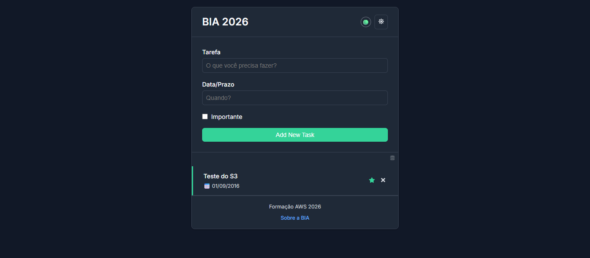

O caminho completo que esse único clique percorreu:

```
navegador  ──►  S3 (site estático)  ──►  API Node.js no ECS  ──►  RDS PostgreSQL
                                                                        │
                              a tarefa "Teste do S3" ficou gravada aqui ─┘
```

### O que foi entregue e onde está a prova

| Entrega | Onde está a prova neste repositório |
|---|---|
| Bucket S3 servindo o site estático | [Fase 7](#fase-7--confirmar-o-bucket-servindo-o-site) · captura `imagens/S3_bucket.png` |
| Script Shell que gera os assets do React | [`react.sh`](react.sh) · [Fase 5](#fase-5--escrever-os-scripts-shell) |
| Endereço da API passado **por argumento** | [`deploy.sh`](deploy.sh) · `./deploy.sh hom http://SEU-IP-DA-API` |
| Sync do diretório local com o bucket | [`s3.sh`](s3.sh) · [Fase 6](#fase-6--gerar-os-assets-e-sincronizar-com-o-bucket) |
| API do Dia 2 servindo o front do S3 | [Fase 1](#fase-1--confirmar-que-a-api-está-no-ar) · captura `imagens/ECS.png` |
| Registro salvo em banco pelo site | [Fase 8](#fase-8--salvar-um-registro-no-banco-pelo-site) · imagem acima |

> **📘 Guia interativo passo a passo**
> Este repositório traz também o [`guia-desafio-3.html`](guia-desafio-3.html): um roteiro navegável, com checklist marcável, resposta esperada de cada comando e uma tabela de solução de problemas. Veja em [Como reproduzir do zero](#8-como-reproduzir-do-zero) as duas formas de abri-lo.

---

## 3. Arquitetura

### 3.1 Visão geral: o problema do acoplamento

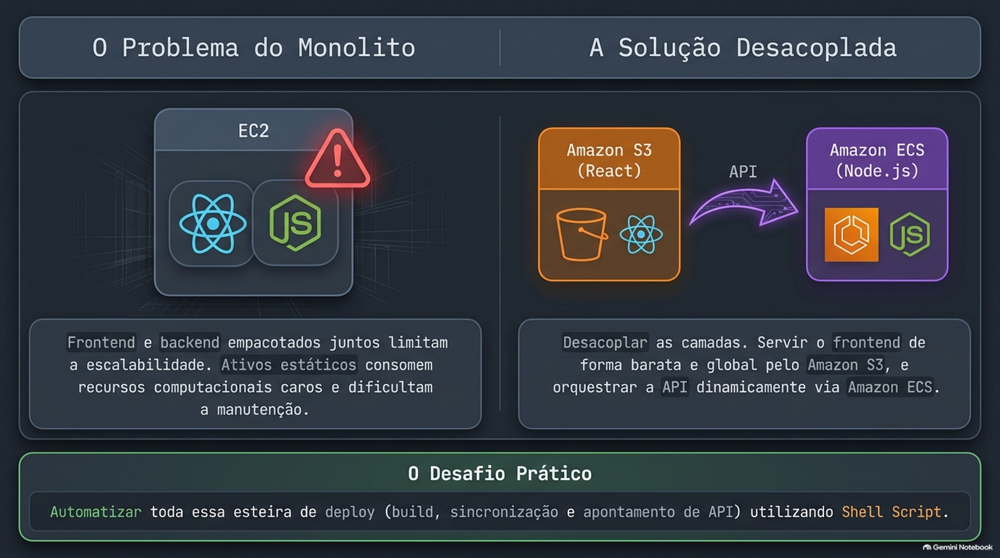

À esquerda, o modelo antigo: React e Node.js empacotados juntos numa EC2. À direita, o modelo deste desafio: o React servido pelo **Amazon S3** e a API orquestrada pelo **Amazon ECS**, conversando por chamadas HTTP.

O ponto que costuma passar despercebido: **um site estático no S3 não tem servidor**. Não existe processo rodando, não existe CPU alocada, não existe "instância do site". Você paga apenas pelo armazenamento (alguns megabytes) e pelas requisições. É por isso que o S3 nunca fica lento com pico de acesso — não há nada para ficar sobrecarregado.

### 3.2 Arquitetura na AWS

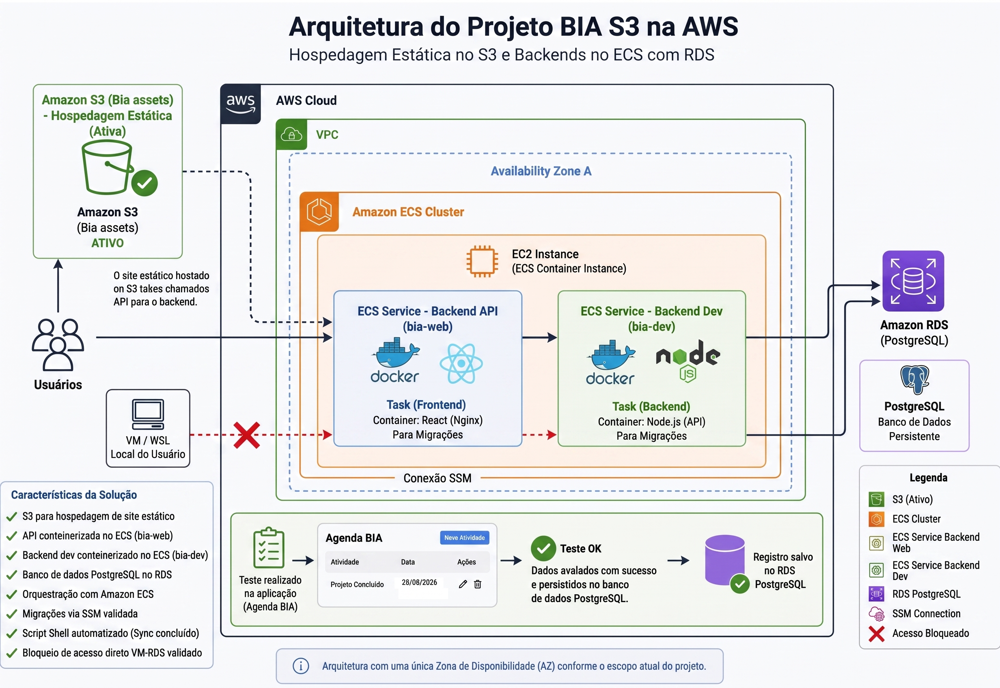

Lendo o desenho de fora para dentro:

| Componente | Papel neste desafio |
|---|---|
| **Amazon S3** (`bia assets`) | Guarda e entrega os arquivos do React. Website hosting ligado, leitura pública permitida por bucket policy |
| **Amazon ECS** (`cluster-bia` / `service-bia`) | Mantém a API Node.js de pé dentro de um contêiner, numa instância EC2 `t3.micro` |
| **Amazon ECR** | Registro onde a imagem Docker `bia:latest` fica armazenada; o ECS busca a imagem aqui |
| **Amazon RDS** (PostgreSQL) | Banco de dados persistente. **Não é publicamente acessível** — só aceita conexões vindas de dentro da VPC |
| **EC2 `bia-dev`** | Máquina de apoio, alcançada por SSM. É dela que a migração do banco é executada |
| **AWS Systems Manager (SSM)** | Abre um terminal na `bia-dev` sem expor porta SSH e sem chave privada |

A **linha vermelha com X** no diagrama é o detalhe mais importante da arquitetura, e está explicada em [3.4](#34-por-que-a-migração-passa-pela-bia-dev).

### 3.3 Mapa de implementação

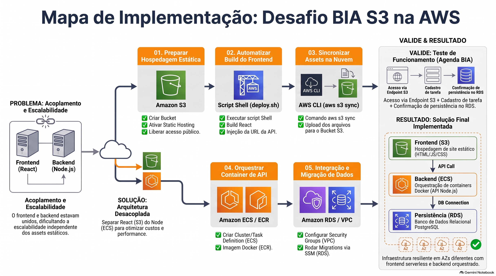

O mesmo trabalho, visto como sequência: **preparar a hospedagem → automatizar o build → sincronizar os assets → orquestrar a API → integrar e migrar o banco → validar de ponta a ponta**.

### 3.4 Por que a migração passa pela bia-dev

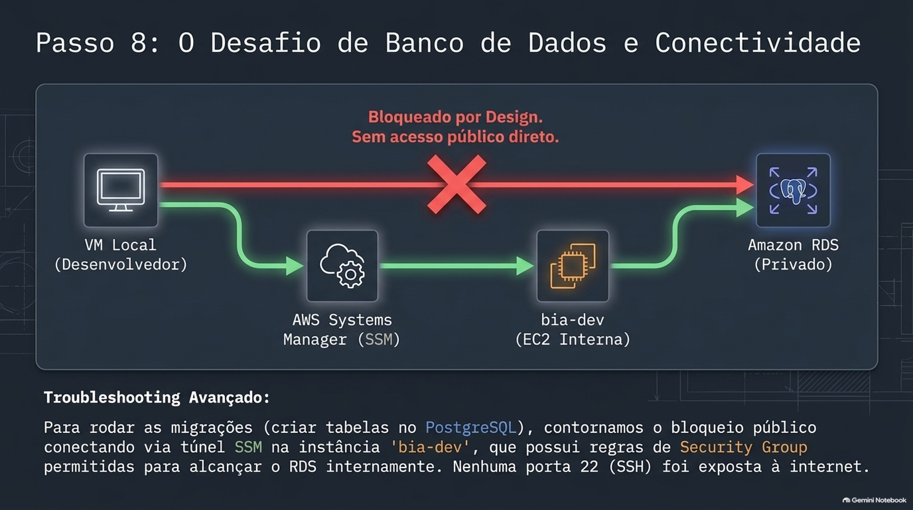

O RDS deste laboratório está com `PubliclyAccessible = False`. Isso significa que **a sua máquina não consegue falar com o banco**, por mais correta que a senha esteja — o pacote nem chega lá.

Não é um obstáculo: é o comportamento correto. Um banco de produção **não deve** estar exposto à internet. Então, em vez de abrir o banco para o mundo (a saída errada), o caminho é:

1. Entrar na EC2 `bia-dev`, que está **dentro da mesma VPC** do banco, usando o **SSM Session Manager** — que não precisa de porta 22 aberta nem de chave `.pem`.
2. Liberar a porta `5432` do Security Group do banco para o **Security Group da `bia-dev`** — origem por grupo, não por IP.
3. Rodar a migração de dentro da `bia-dev`.

O banco nunca fica público em momento algum. É o mesmo padrão de *bastion host* que se usa em produção, com a vantagem de o SSM dispensar chave privada.

---

## 4. Ambiente da máquina

Tudo neste desafio foi executado a partir do **WSL 2** (Windows Subsystem for Linux) rodando no Windows 11.

| Ferramenta | Versão / observação |
|---|---|
| Sistema | Windows 11 + **WSL 2 · Ubuntu 24.04** |
| AWS CLI | v2, autenticada com um profile nomeado (`formacao_aws`) |
| Node.js / npm | Node 25 · npm 11 — usados apenas para o build do React |
| Docker | Instalado na EC2 `bia-dev` (não é necessário na máquina local) |
| Editor | VS Code, conectado ao WSL |

### Uma decisão que vale explicar: duas pastas diferentes

```
Disco do Windows                        Disco do Linux (dentro do WSL)
┌──────────────────────────────┐        ┌──────────────────────────────┐
│  pasta do repositório        │        │  ~/DESAFIOS-FUNDAMENTAIS/bia │
│    ├── deploy.sh             │        │    (clone da BIA)            │
│    ├── react.sh              │  lê ─► │    └── client/build/  ◄── o  │
│    ├── s3.sh                 │        │        build acontece aqui   │
│    ├── README.md             │        └──────────────────────────────┘
│    └── imagens/              │
└──────────────────────────────┘
```

**Por que separar?** O `npm install` do React cria dezenas de milhares de arquivos em `node_modules`. Se essa pasta ficar no disco do Windows, o WSL a acessa por uma camada de tradução (`/mnt/c`), e o build fica **várias vezes mais lento**. Pior ainda se a pasta estiver sincronizada com um serviço de nuvem: vira uma sincronização que nunca termina.

Os scripts resolvem isso lendo a variável **`BIA_DIR`**: ficam versionados de um lado e trabalham do outro.

---

## 5. Pré-requisitos: o que vem do Desafio 2

Este desafio **não começa do zero**. A infraestrutura abaixo já existia, criada no desafio anterior:

### Imagem Docker publicada no ECR

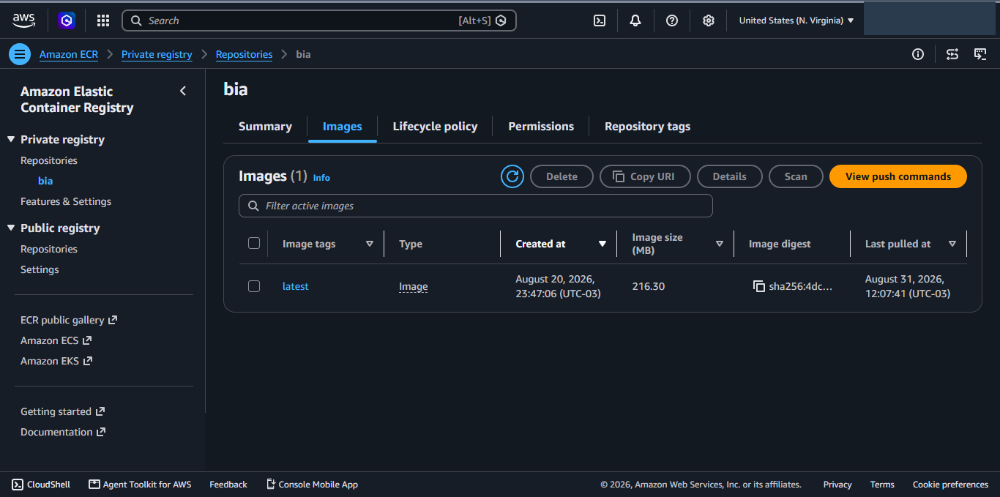

O ECR é o "GitHub de imagens Docker" da AWS. A imagem `bia:latest` está aqui, e é dela que o ECS puxa a aplicação.

### Cluster e serviço no ECS

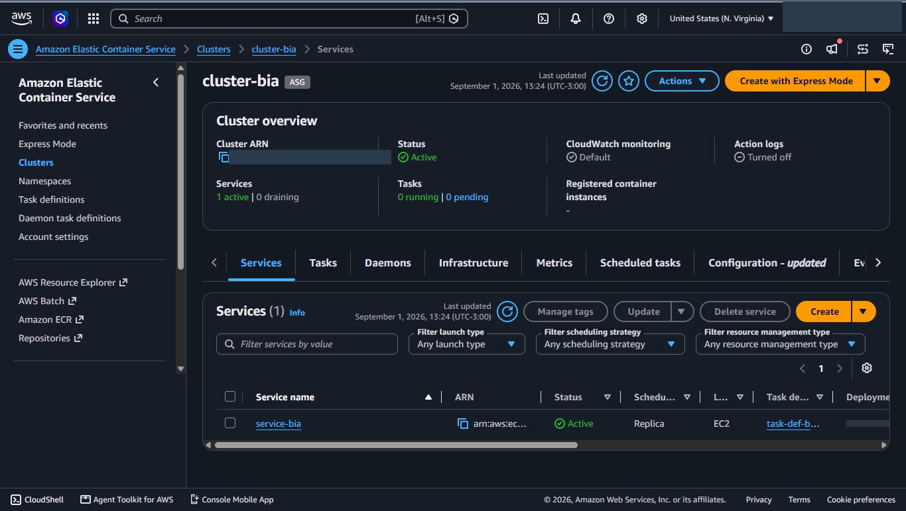

- **Cluster** `cluster-bia` — o poder computacional (uma instância EC2 `t3.micro`, gerenciada por um Auto Scaling Group).
- **Task Definition** `task-def-bia` — a "receita": qual imagem usar, quanta CPU e memória, o mapeamento de portas `80:8080` e as variáveis de ambiente do banco.
- **Service** `service-bia` — o gerente: lê a receita, lança a task e a mantém de pé.

> 💡 Essa EC2 do cluster aparece no console do EC2 com o nome `ECS Instance - cluster-bia`, gerado pelo Auto Scaling Group — a captura está em [Instâncias EC2](#instâncias-ec2).

### Instâncias EC2

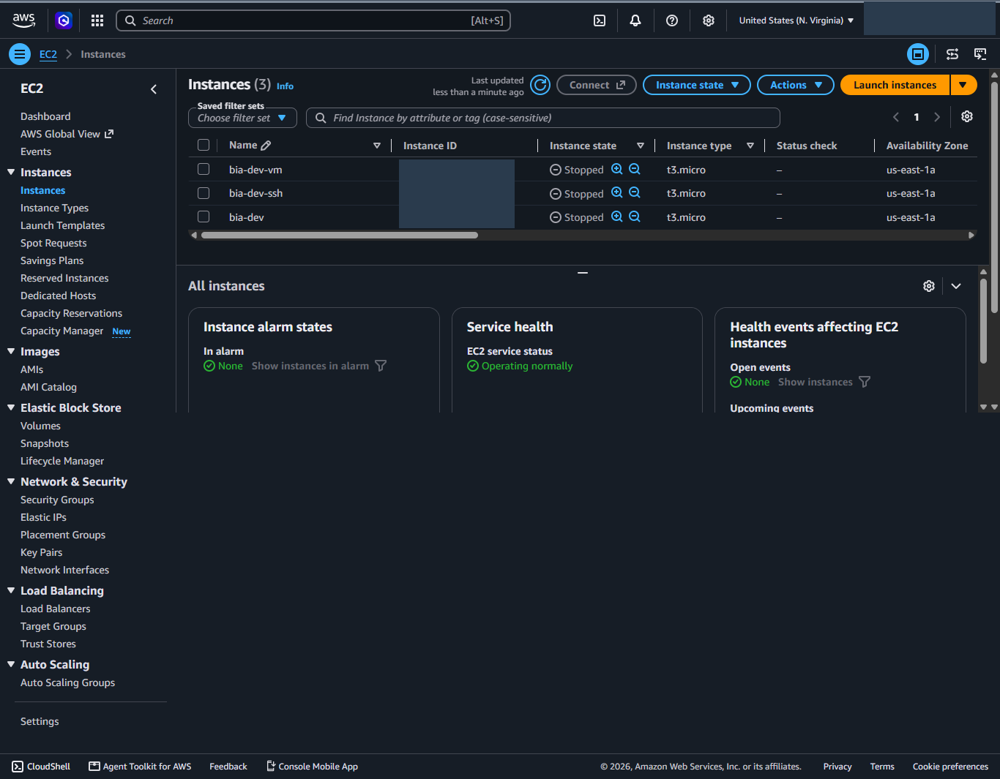

A instância `bia-dev` é a máquina de apoio de onde a migração do banco será executada. (Os identificadores estão tarjados nas capturas — são específicos da conta e não acrescentam nada a quem lê.)

Repare no que **não** aparece na captura acima: a máquina do cluster ECS. Ela foi tirada com o laboratório desligado — e quem cria essa EC2 é o Auto Scaling Group do `cluster-bia`, então ela só existe enquanto o cluster está de pé. Com o cluster ligado, ela aparece na mesma lista:

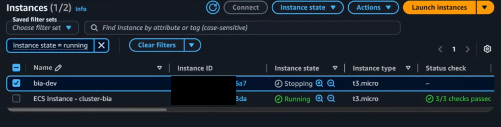

O nome `ECS Instance - cluster-bia` é gerado pelo Auto Scaling Group, e não escolhido por você: é assim que se reconhece, no console do EC2, qual máquina pertence a qual cluster. É essa instância que responde em `http://xx.xx.xx.xx` — a API que o site do S3 chama.

> 💡 A lista está filtrada por `Instance state = running`, por isso as máquinas paradas não aparecem. A `bia-dev` ainda consta porque a captura pegou o momento em que ela estava sendo desligada (`Stopping`). A do cluster continua `Running` — e derrubá-la exige mexer na capacidade desejada do ASG, não um `stop` ([Fase 9](#fase-9--encerrar-o-laboratório-sem-deixar-conta-aberta)).

### Banco de dados RDS

Uma instância PostgreSQL chamada `bia`, com `PubliclyAccessible = False`.

> ⚠️ **Atenção ao nome:** a instância do RDS chama-se **`bia`**. O **`bia-db`** é o *Security Group* dela. São coisas diferentes — confundir os dois faz o cliente do banco apontar para lugar nenhum.

---

## 6. Passo a passo da solução

> **Como ler os comandos.** O símbolo antes do comando diz **em qual máquina você está** — e é o sinal mais confiável de todos:
>
> ```
> $                 →  no seu terminal WSL (a sua máquina)
> sh-5.2$           →  dentro da EC2 bia-dev, como o usuário ssm-user
> [ec2-user ~]$     →  dentro da EC2 bia-dev, como o usuário ec2-user
> ```
>
> Os identificadores aparecem mascarados (`xxxxxxxxxxxx`, `i-xxxxxxxxxxxx`, `xx.xx.xx.xx`) — são os do **seu** ambiente e você os descobre nos passos indicados.

---

### Fase 0 — Autenticar a sessão e carregar as variáveis

**Por quê:** todo comando da AWS precisa saber *quem é você*. Uma máquina pode ter vários perfis de acesso configurados, e usar o errado produz erros de permissão que parecem erros de configuração ("o recurso não existe") — quando na verdade o recurso existe, mas o usuário logado não pode vê-lo.

**Conferir quais perfis existem nesta máquina:**

```bash
aws configure list-profiles
```

Lista os perfis de acesso salvos em `~/.aws/`. Deve aparecer o perfil do curso (aqui chamado `formacao_aws`).

**Renovar o login:**

```bash
aws login --profile formacao_aws
```

As credenciais deste ambiente são **temporárias** e expiram. O comando abre o navegador para você confirmar a identidade. Se qualquer comando adiante responder `Your session has expired`, volte aqui.

**Tornar esse perfil o padrão da sessão e confirmar quem você é:**

```bash
export AWS_PROFILE=formacao_aws
aws sts get-caller-identity
```

O `export` faz todos os comandos seguintes usarem esse perfil sem precisar repetir `--profile`. O `get-caller-identity` é o "espelho" da AWS: devolve o número da conta e o ARN do usuário autenticado.

```json
{
    "UserId": "AIDAxxxxxxxxxxxxxxxxx",
    "Account": "xxxxxxxxxxxx",
    "Arn": "arn:aws:iam::xxxxxxxxxxxx:user/usuario-xxxx"
}
```

**Guardar os identificadores do ambiente num arquivo:**

Cada terminal novo perde as variáveis. Em vez de redigitar, salve uma vez e recarregue com um comando:

```bash
mkdir -p ~/DESAFIOS-FUNDAMENTAIS && cat > ~/DESAFIOS-FUNDAMENTAIS/variaveis.sh <<'FIM'
export AWS_PROFILE=formacao_aws
export AWS_REGION=us-east-1
export AWS_DEFAULT_REGION=us-east-1

export BUCKET_NAME=seu-bucket-xxxx
export WEBSITE_URL=http://seu-bucket-xxxx.s3-website-us-east-1.amazonaws.com

export DEV_INSTANCE_ID=i-xxxxxxxxxxxx
export SG_DEV=sg-xxxxxxxxxxxx
export SG_DB=sg-xxxxxxxxxxxx

export API_URL=http://xx.xx.xx.xx

# copia da BIA no disco do Linux, onde o build roda
export BIA_DIR=$HOME/DESAFIOS-FUNDAMENTAIS/bia
FIM
```

O `cat > arquivo <<'FIM'` grava tudo que vier até a palavra `FIM` dentro do arquivo. As aspas simples em `'FIM'` impedem que o shell tente interpretar os `$` — o texto é gravado literalmente.

**Onde encontrar cada valor:** `DEV_INSTANCE_ID` e `API_URL` saem da [Fase 1](#fase-1--confirmar-que-a-api-está-no-ar); `SG_DEV` e `SG_DB` saem da [Fase 3](#fase-3--abrir-o-caminho-da-bia-dev-até-o-rds); `BUCKET_NAME` é o nome que você deu ao bucket.

**Carregar e conferir:**

```bash
source ~/DESAFIOS-FUNDAMENTAIS/variaveis.sh
echo "$AWS_PROFILE | $BUCKET_NAME | $DEV_INSTANCE_ID | $API_URL"
```

O `source` executa o arquivo **dentro do terminal atual**, para que as variáveis fiquem valendo ali. (Rodar `./variaveis.sh` **não** funcionaria: criaria um terminal filho, e as variáveis nasceriam e morreriam nele.)

> 🔁 **Sempre que abrir um terminal novo**, rode esse `source` antes de qualquer coisa. É a causa número um de erros do tipo `Invalid length for parameter` — a variável chegou vazia.

> 🔒 **`variaveis.sh` está no [`.gitignore`](.gitignore)** deste repositório. Ele contém os identificadores do seu ambiente e não deve ir para o GitHub.

---

### Fase 1 — Confirmar que a API está no ar

**Por quê:** o React que vai para o S3 precisa saber **para onde falar**. Esse endereço é gravado dentro do arquivo JavaScript no momento do build — depois disso não dá para mudar sem refazer o build. Então descubra e teste a URL **antes** de gerar qualquer coisa.

**Listar as instâncias ligadas:**

```bash
aws ec2 describe-instances \
  --filters "Name=instance-state-name,Values=running" \
  --query 'Reservations[].Instances[].{Nome:Tags[?Key==`Name`]|[0].Value,Id:InstanceId,IP:PublicIpAddress,SG:SecurityGroups[0].GroupName}' \
  --output table
```

O `--filters` traz só as máquinas ligadas. O `--query` é uma linguagem de consulta (JMESPath) que a AWS CLI aplica sobre a resposta: em vez de despejar um JSON gigante, monta uma tabela com as quatro colunas que interessam.

Você deve ver duas máquinas: a `bia-dev` e a instância do `cluster-bia` — é o IP público desta segunda que vira o `API_URL`.

> ⚠️ **O IP público muda.** Toda vez que a instância for parada e ligada de novo, ela volta com outro endereço. É exatamente o problema que um Load Balancer resolve em produção.

**Testar a API:**

```bash
curl -s -i "$API_URL/api/versao"
```

O `curl` faz uma requisição HTTP; o `-i` mostra também os cabeçalhos da resposta e o `-s` esconde a barra de progresso.

```http
HTTP/1.1 200 OK
Access-Control-Allow-Origin: *
Content-Type: text/html; charset=utf-8

Bia 4.3.0
```

> 💡 **O cabeçalho `Access-Control-Allow-Origin: *` é o que salva a Fase 8.** Ele diz que a API aceita chamadas vindas de qualquer origem — inclusive do endereço do S3, que é um domínio diferente. Sem ele, o navegador bloquearia a requisição por CORS.

**Fotografar o estado inicial do banco:**

```bash
curl -s -i "$API_URL/api/tarefas"
```

Neste momento, isso ainda **falha** — e é justamente a prova de que a Fase 4 é necessária:

```http
HTTP/1.1 500 Internal Server Error

{"message":"database \"bia\" does not exist"}
```

Repare no que esse erro conta: a API **chegou** no RDS e foi autenticada. Se não chegasse, a resposta seria `timeout` ou `ECONNREFUSED`. O que falta é o *database* e as tabelas, que ninguém criou ainda.

---

### Fase 2 — Destravar o SSM da bia-dev

**Por quê:** o desafio pede para entrar na `bia-dev` pelo **Session Manager**, sem SSH. Para isso funcionar, a instância precisa de uma **role** (um crachá de permissões) que autorize o agente do SSM instalado nela a se registrar no serviço.

**Diagnosticar o problema:**

```bash
aws ssm describe-instance-information \
  --query 'InstanceInformationList[].{Id:InstanceId,Ping:PingStatus}' --output json

aws ec2 describe-instances --instance-ids "$DEV_INSTANCE_ID" \
  --query 'Reservations[0].Instances[0].IamInstanceProfile' --output json
```

O primeiro comando pergunta ao SSM quais máquinas ele enxerga; o segundo pergunta ao EC2 qual crachá está pendurado na instância. As respostas `[]` e `null` são **o mesmo fato dito de duas formas**: sem role anexada, o agente não tem credencial para se registrar.

**Liberar as permissões (no Console da AWS):**

O usuário do laboratório não pode alterar as próprias permissões — `iam:*` é negado para ele. Então esta parte se faz uma única vez, no Console, com um usuário administrador:

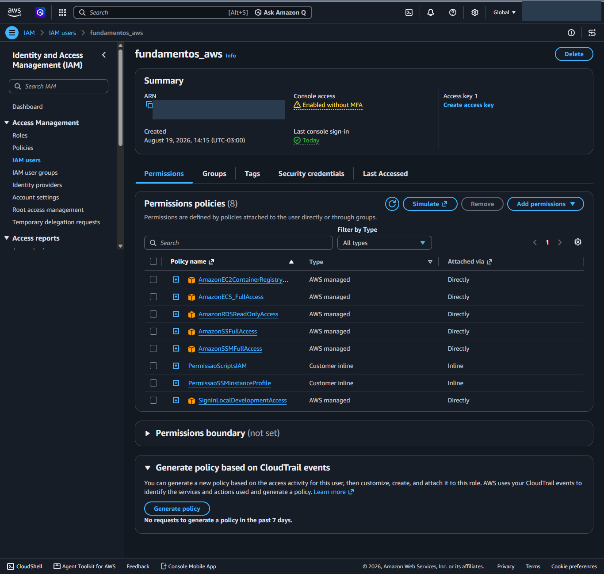

```
IAM  >  Users  >  seu-usuario  >  Add permissions  >  Attach policies directly

    [x] AmazonRDSReadOnlyAccess    (ver o endpoint do banco, na Fase 3)
    [x] AmazonECS_FullAccess       (ver o serviço e a task definition do Dia 2)
    [x] AmazonS3FullAccess         (o sync da Fase 6 escreve no bucket)
```

E mais uma policy **inline**, no mesmo lugar (`Create inline policy > JSON`), que autoriza pendurar a role na instância:

```json
{
  "Version": "2012-10-17",
  "Statement": [
    {
      "Sid": "GerenciarInstanceProfileEEstadoDaEC2",
      "Effect": "Allow",
      "Action": [
        "ec2:AssociateIamInstanceProfile",
        "ec2:DisassociateIamInstanceProfile",
        "ec2:ReplaceIamInstanceProfileAssociation",
        "ec2:DescribeIamInstanceProfileAssociations",
        "ec2:StartInstances",
        "ec2:StopInstances",
        "ec2:RebootInstances"
      ],
      "Resource": "*"
    },
    {
      "Sid": "PassarARoleDoSSMParaEC2",
      "Effect": "Allow",
      "Action": "iam:PassRole",
      "Resource": "arn:aws:iam::xxxxxxxxxxxx:role/role-acesso-ssm",
      "Condition": {
        "StringEquals": { "iam:PassedToService": "ec2.amazonaws.com" }
      }
    }
  ]
}
```

> 💡 **Por que o `iam:PassRole` precisa estar aí.** Associar um instance profile é *entregar um crachá a uma máquina*. A AWS trata isso como uma permissão à parte, justamente para ninguém conceder a si mesmo um privilégio maior por meio de uma EC2. É por isso que anexar `AmazonEC2FullAccess` sozinho **não** resolveria: essa policy não inclui `PassRole`.

**Testar as três permissões de uma vez, sem executar nada:**

```bash
aws rds describe-db-instances --query 'DBInstances[].DBInstanceIdentifier' --output text
aws ecs describe-services --cluster cluster-bia --services service-bia --query 'services[0].status' --output text
aws ec2 reboot-instances --instance-ids "$DEV_INSTANCE_ID" --dry-run
```

O `--dry-run` testa a permissão **sem executar a ação**. A resposta esperada é confusa de propósito:

```
aws: [ERROR]: An error occurred (DryRunOperation) when calling the RebootInstances
operation: Request would have succeeded, but DryRun flag is set.
```

> ⚠️ **A palavra `ERROR` aí é o sucesso.** Leia a frase ao pé da letra: *"a requisição teria dado certo, mas a flag DryRun está ligada"*. A instância **não** foi reiniciada. A API do EC2 nunca devolve "sucesso" num dry-run — ela sempre levanta uma exceção, e o nome dela é a resposta: `DryRunOperation` significa que você **tem** a permissão; `UnauthorizedOperation` significa que **falta**.

**Pendurar a role na instância:**

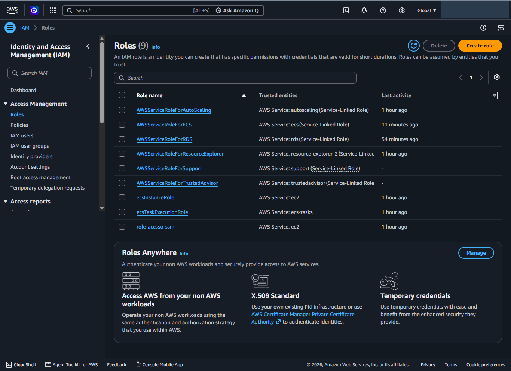

```bash
aws ec2 associate-iam-instance-profile \
  --instance-id "$DEV_INSTANCE_ID" \
  --iam-instance-profile Name=role-acesso-ssm
```

A role `role-acesso-ssm` (que já traz a policy `AmazonSSMManagedInstanceCore`) passa a valer para a instância. A resposta traz `"State": "associating"`.

> ⚠️ **`associated` não é `Online` — e é aqui que quase todo mundo trava.** São dois sistemas diferentes. O `associated` é a API do EC2 dizendo que a role está anexada, e isso vale imediatamente. O `PingStatus` vem do **agente dentro da máquina**, que subiu sem credencial nenhuma e só tenta de novo de tempos em tempos. Ver `None` logo depois de associar é o esperado. **Não refaça a associação.**

**Esperar o agente se registrar:**

```bash
for i in $(seq 1 30); do
    ping=$(aws ssm describe-instance-information \
      --filters "Key=InstanceIds,Values=$DEV_INSTANCE_ID" \
      --query 'InstanceInformationList[0].PingStatus' --output text)
    echo "tentativa $i: $ping"
    [ "$ping" = "Online" ] && break
    sleep 30
done
```

Um laço que pergunta o estado a cada 30 segundos e para assim que a resposta for `Online`. Cobre cerca de 15 minutos — costuma resolver entre 5 e 20.

**Com pressa?** Um reboot força o agente a começar do zero, já com a role no lugar, e resolve em cerca de 1 minuto:

```bash
aws ec2 reboot-instances --instance-ids "$DEV_INSTANCE_ID"
sleep 60
aws ssm describe-instance-information \
  --filters "Key=InstanceIds,Values=$DEV_INSTANCE_ID" \
  --query 'InstanceInformationList[0].PingStatus' --output text
```

O `reboot-instances` **não imprime nada** quando dá certo — o silêncio é sucesso.

**Abrir a sessão:**

```bash
aws ssm start-session --target "$DEV_INSTANCE_ID"
```

```
Starting session with SessionId: usuario-xxxx-0a1b2c3d4e5f6a7b8
sh-5.2$
```

O prompt mudou para `sh-5.2$`: você está **dentro da EC2**, sem ter aberto uma única porta SSH e sem ter usado nenhuma chave privada. Para voltar, digite `exit`.

---

### Fase 3 — Abrir o caminho da bia-dev até o RDS

**Por quê:** o Security Group do banco só aceita conexões vindas do Security Group `bia-web` (onde a API roda). A `bia-dev` ainda não está nessa lista — e é ela que vai rodar a migração.

> ⚠️ **Esta fase inteira roda no WSL, não dentro da `bia-dev`.** Se o seu prompt ainda for `sh-5.2$`, digite `exit` antes de continuar. Dentro da EC2 as variáveis do desafio não existem, e os comandos falham com `The security-group ID '' is malformed`.

**Liberar a porta 5432 para o Security Group da `bia-dev`:**

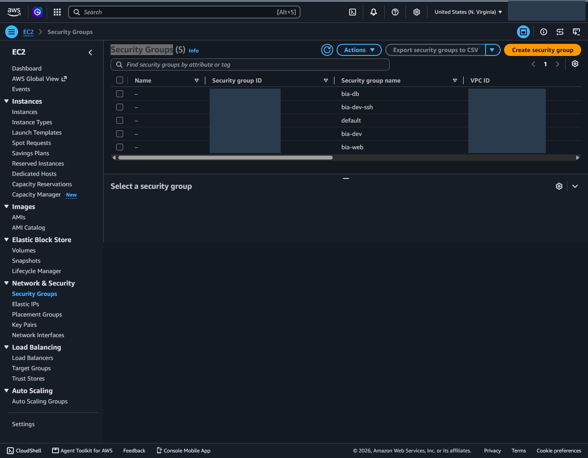

```bash
aws ec2 authorize-security-group-ingress \
  --group-id "$SG_DB" \
  --protocol tcp --port 5432 \
  --source-group "$SG_DEV"
```

A origem da regra é **um Security Group, não um IP**. É assim que a AWS diz "aceite qualquer máquina que use o grupo `bia-dev`" — sem depender de IP fixo e sem precisar reeditar a regra quando a máquina reiniciar.

> Se responder `InvalidPermission.Duplicate`, a regra já existe. Siga em frente.

**Conferir que agora são duas origens, e só duas:**

```bash
aws ec2 describe-security-groups --group-ids "$SG_DB" \
  --query 'SecurityGroups[0].IpPermissions[].UserIdGroupPairs[].GroupId' --output text
```

Devem aparecer dois grupos: o da API (`bia-web`) e o da máquina de migração (`bia-dev`). **Nenhuma regra com origem `0.0.0.0/0` na porta 5432** — o banco continua fechado para a internet.

**Descobrir o endereço do banco:**

```bash
aws rds describe-db-instances \
  --query 'DBInstances[].{Id:DBInstanceIdentifier,Endpoint:Endpoint.Address,Porta:Endpoint.Port,Publico:PubliclyAccessible,Usuario:MasterUsername,Status:DBInstanceStatus}' \
  --output table
```

`Publico = False` é o comportamento **correto**: é exatamente por isso que a migração precisa passar pela `bia-dev`.

**Recuperar as credenciais do banco:**

A API já se conecta ao banco — então usuário e senha estão na definição da tarefa do ECS, em variáveis de ambiente:

```bash
aws ecs describe-task-definition --task-definition task-def-bia \
  --query 'taskDefinition.containerDefinitions[0].environment' --output table
```

> 🔐 **Senha em texto puro é o ponto fraco desta arquitetura.** Qualquer pessoa com `ecs:DescribeTaskDefinition` lê a senha do banco. Para um laboratório resolve; **o caminho correto em produção é guardar a senha no AWS Secrets Manager** e referenciá-la no bloco `secrets` da task definition — a BIA já suporta isso pela variável `DB_SECRET_NAME`. Nunca publique a saída deste comando em print ou repositório.

---

### Fase 4 — Criar o database e rodar a migração

**Por quê:** o erro `database "bia" does not exist` da Fase 1 diz tudo — o servidor PostgreSQL está de pé, mas o banco e as tabelas nunca foram criados. É o "X" do diagrama: quem faz isso é a `bia-dev`, não a sua máquina.

**Entrar na máquina:**

```bash
aws ssm start-session --target "$DEV_INSTANCE_ID"
```

Depois, **já dentro da EC2**, e esta linha vai sozinha:

```bash
sudo su - ec2-user
```

O `sudo su -` troca de usuário e já abre na pasta pessoal dele — é o **hífen** que faz isso, carregando o ambiente de login. Espere o prompt virar `[ec2-user ~]$` antes de colar a próxima coisa.

> ⚠️ **Por que uma linha de cada vez.** O `sudo su -` abre um **shell novo**. Linhas coladas junto com ele não chegam nesse shell: ficam paradas no buffer de entrada do shell de fora e só são executadas quando você sair dele — reaparecendo muito tempo depois, sem relação nenhuma com o que você acabou de digitar. Vale para qualquer comando que troque de shell, `aws ssm start-session` incluído.

**Conferir o Docker e trazer o código:**

```bash
docker --version
docker ps
git clone https://github.com/henrylle/bia
cd bia
```

A migração lê os arquivos de `database/migrations`, então o projeto precisa estar **nesta** máquina. A cópia que você clonou no Windows não serve: ela está do outro lado, e o RDS só aceita conexão vinda daqui.

**Apontar as variáveis do banco:**

```bash
export DB_HOST=bia.xxxxxxxxxxxx.us-east-1.rds.amazonaws.com
export DB_PORT=5432
export DB_USER=postgres
```

E a senha, **nesta linha sozinha, por último**:

```bash
read -s -p "Senha do RDS: " DB_PWD; export DB_PWD; echo
```

O `read -s` lê a senha **sem exibir na tela**. Nada aparece enquanto você digita, e é assim mesmo.

> 💡 **Por que não um `export DB_PWD=...` como os outros três.** Três motivos: (1) não há texto de exemplo para alguém copiar por engano; (2) a senha **não fica no `~/.bash_history`**; (3) não passa pela interpretação de `$`, `!` e `&` que aspas duplas fariam.
>
> ⚠️ A linha do `read -s` tem de ser **a última** do que você colar. Ele lê a próxima linha da entrada — se houver um comando logo abaixo, é esse comando que vira a senha.

**Conferir sem revelar a senha:**

```bash
echo "$DB_HOST | $DB_USER | ${#DB_PWD} caracteres"
```

O `${#VARIAVEL}` conta os caracteres em vez de imprimi-los: prova que a senha entrou inteira, sem mostrar qual é. Se vier `0 caracteres`, o `read` não recebeu nada.

**Criar o database e migrar:**

```bash
docker run --rm -v "$PWD":/app -w /app \
  -e DB_HOST="$DB_HOST" -e DB_PORT="$DB_PORT" \
  -e DB_USER="$DB_USER" -e DB_PWD="$DB_PWD" \
  public.ecr.aws/docker/library/node:24.18.0-slim \
  sh -c 'npm install --loglevel=error && npx sequelize db:create && npx sequelize db:migrate'
```

Um contêiner descartável resolve os dois passos sem instalar nada na máquina. Peça por peça:

| Trecho | O que faz |
|---|---|
| `--rm` | Apaga o contêiner assim que ele terminar — não deixa lixo |
| `-v "$PWD":/app` | Monta a pasta atual (o projeto da BIA) dentro do contêiner, em `/app` |
| `-w /app` | Define `/app` como a pasta de trabalho lá dentro |
| `-e DB_HOST=...` | Repassa as variáveis do passo anterior para dentro do contêiner |
| `public.ecr.aws/...` | A imagem do Node vem do **registro público da AWS**, e não do Docker Hub — assim não se esbarra no limite de downloads anônimos |
| `db:create` | Cria o *database* chamado `bia` |
| `db:migrate` | Cria as tabelas, lendo os arquivos de `database/migrations` |

Nada de SQL na mão: os dois comandos são do `sequelize-cli` e leem o mesmo `config/database.js` da aplicação — então a estrutura nasce **exatamente** igual à que a API espera.

```
Database bia created.
== 20210924000838-criar-tarefas: migrating =======
== 20210924000838-criar-tarefas: migrated (0.087s)
```

> `Database bia already exists` **não é erro** — quer dizer que o `db:create` já rodou antes; o `db:migrate` na sequência continua normalmente.

**Voltar ao WSL e reverificar:**

Digite `exit` uma linha de cada vez até o prompt voltar a ser o do seu WSL. Então:

```bash
curl -s -i "$API_URL/api/tarefas"
```

```http
HTTP/1.1 200 OK

{"dbTime":41,"data":[]}
```

**O 500 virou 200.** A lista vazia é exatamente o esperado: o banco existe, a tabela existe, e ninguém criou tarefa ainda. Quem vai criar a primeira é o site, na Fase 8.

---

### Fase 5 — Escrever os scripts Shell

**Por quê:** este é o entregável central do desafio. Três arquivos, seguindo a estrutura modular da aula: `react.sh` faz o build, `s3.sh` faz o envio, e `deploy.sh` orquestra os dois — recebendo o endereço da API por argumento.

**A estrutura:**

```
deploy.sh  (o maestro)
   │
   ├── . react.sh   ──►  build()      →  npm install + vite build
   └── . s3.sh      ──►  envio_s3()   →  aws s3 sync
```

O `.` (ponto) é o mesmo que `source`: carrega as funções de outro arquivo **dentro do script atual**, para que possam ser chamadas ali.

**Conferir o terreno antes de escrever:**

```bash
grep -n "outDir" "$BIA_DIR/client/vite.config.js"
grep -rn "VITE_API_URL" "$BIA_DIR/client/src/App.jsx"
```

```
    outDir: 'build',
13:const apiUrl = import.meta.env.VITE_API_URL || "http://localhost:8080";
```

> ⚠️ **Esta versão da BIA usa Vite, não Create React App.** A aula mostra `REACT_APP_API_URL` e a variável `NODE_OPTIONS=--openssl-legacy-provider` — aquilo valia para a versão antiga. Aqui a variável é **`VITE_API_URL`** e a pasta de saída é **`client/build`**.
>
> **Esse detalhe decide o desafio.** Se você usar o nome antigo, o build **funciona** e não dá erro nenhum — mas a variável chega vazia, o código cai no valor padrão `http://localhost:8080`, e o site publicado no S3 tenta chamar a API na máquina de quem está visitando. Resultado: tela em branco, sem mensagem de erro.
>
> A lição que fica: **copie do `Dockerfile` do projeto a linha que gera os assets.** É a fonte da verdade sobre como aquele projeto se constrói, em qualquer versão.

Os três scripts estão neste repositório e explicados linha a linha na [seção 7](#7-os-três-scripts-explicados-linha-a-linha).

**Marcar como executáveis:**

```bash
chmod +x deploy.sh react.sh s3.sh
```

O `chmod +x` dá ao arquivo a permissão de ser executado como programa. Sem isso, `./deploy.sh` responde `Permission denied`.

**Testar as validações, de propósito errado:**

Um script bom **falha rápido e explica como se usa** — antes de gastar minutos num `npm install`:

```bash
./deploy.sh;                            echo "saida: $?"
./deploy.sh dev http://xx.xx.xx.xx;     echo "saida: $?"
./deploy.sh hom;                        echo "saida: $?"
```

O `$?` guarda o **código de saída** do último comando: `0` é sucesso, qualquer outro número é falha.

```
Ambiente invalido

Uso:     ./deploy.sh <ambiente> <URL_DA_API>
Exemplo: ./deploy.sh hom http://SEU-IP-DA-API
saida: 1
...
Erro: informe a URL da API.
saida: 1
```

Os três casos são recusados com código `1` e **nada foi enviado ao S3**. Repare que `dev` é recusado: o `if` só aceita `hom` e `prd`, exatamente como na aula.

---

### Fase 6 — Gerar os assets e sincronizar com o bucket

**Por quê:** é a entrega central do desafio, e acontece num comando só.

```bash
./deploy.sh hom "$API_URL"
```

Dois argumentos: o **ambiente** (validado pelo `if`) e a **URL da API** (que o enunciado exige que venha por argumento). A saída resumida:

```
Vou iniciar deploy no ambiente: hom
O endereco da API sera: http://xx.xx.xx.xx
Bucket de destino: seu-bucket-xxxx

Fazendo deploy...
Fazendo build do react...
 Iniciando build...

vite v5.4.19 building for production...
build/index.html                   0.46 kB
build/assets/index-C1a2B3c4.css   12.80 kB
build/assets/index-D5e6F7g8.js   242.31 kB
 Build finalizado

Fazendo envio para o s3...
upload: .../client/build/index.html to s3://seu-bucket-xxxx/index.html
upload: .../client/build/assets/index-C1a2B3c4.css to s3://.../index-C1a2B3c4.css
 Envio finalizado

Finalizado
Site: http://seu-bucket-xxxx.s3-website-us-east-1.amazonaws.com
```

> A **primeira** execução demora de 1 a 3 minutos: o `npm install` do client baixa as dependências do Vite. As próximas são quase instantâneas.

**Provar que a URL certa entrou no bundle:**

Este é o teste que separa *"buildou"* de *"buildou apontando para o lugar certo"*:

```bash
grep -rho "xx.xx.xx.xx" "$BIA_DIR/client/build/assets" | head -1
```

O `grep -r` procura recursivamente dentro da pasta, o `-o` mostra só o trecho que casou e o `-h` omite o nome do arquivo. Se o IP da sua API aparecer, o endereço foi gravado dentro do JavaScript gerado. **Se não achar nada**, o build saiu sem a variável — confira se o `react.sh` usa `VITE_API_URL`, apague `client/build` e rode de novo.

**Listar o que chegou no bucket:**

```bash
aws s3 ls "s3://$BUCKET_NAME" --recursive --human-readable
```

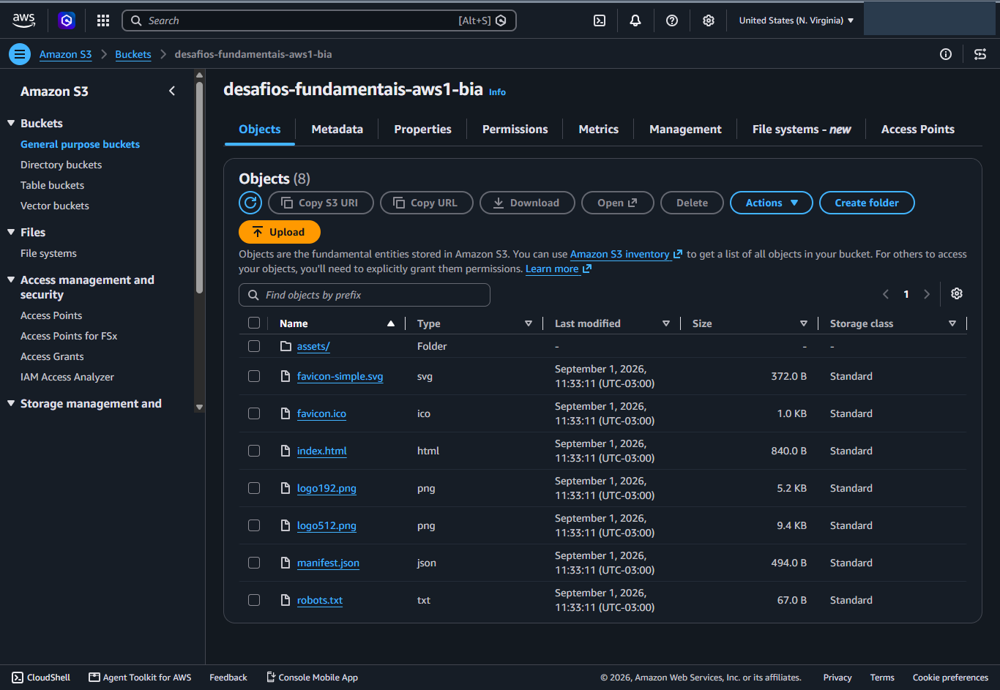

> Não tente casar os nomes com os do exemplo: o Vite carimba um **hash novo** no nome do arquivo a cada build. O que precisa estar lá é a **forma**: um `index.html` na raiz e, dentro de `assets/`, um `.js` e um `.css`.

---

### Fase 7 — Confirmar o bucket servindo o site

**Por quê:** um bucket comum guarda arquivos, mas não é um site. Duas configurações transformam um no outro: o **website hosting** (que define qual arquivo entregar) e a **bucket policy** (que autoriza qualquer visitante a lê-los).

**Website hosting:**

```bash
aws s3 website "s3://$BUCKET_NAME" \
  --index-document index.html \
  --error-document index.html
```

O **index document** é o arquivo entregue quando alguém acessa a raiz do site.

O **error document** apontando também para o `index.html` parece estranho, mas é o truque que faz as rotas do React funcionarem: quando o visitante recarrega a página numa rota interna, o S3 não encontra nenhum arquivo com aquele nome, cai no documento de erro, entrega o `index.html` — e o React Router resolve a rota no navegador. **Sem isso, recarregar uma página interna devolve 404.**

**Leitura pública, com o mínimo de permissão:**

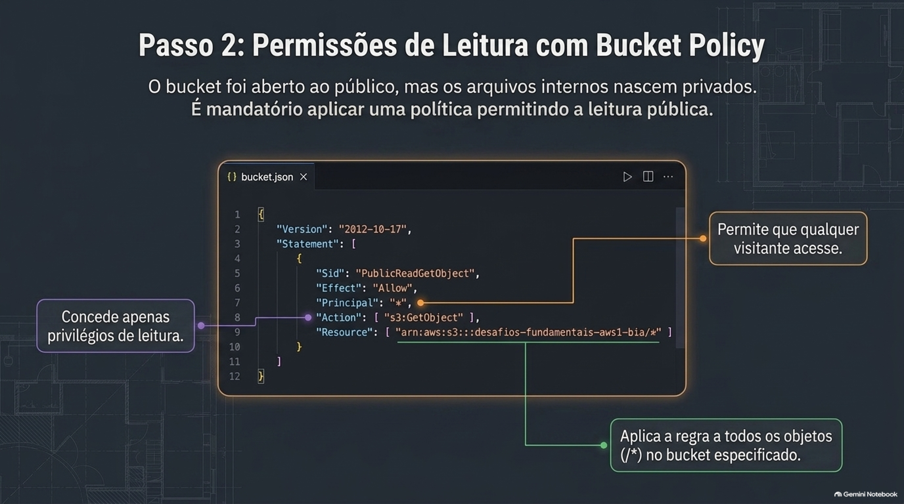

```json
{
    "Version": "2012-10-17",
    "Statement": [
        {
            "Sid": "PublicReadGetObject",
            "Effect": "Allow",
            "Principal": "*",
            "Action": [ "s3:GetObject" ],
            "Resource": [ "arn:aws:s3:::SEU-BUCKET/*" ]
        }
    ]
}
```

Lendo em português: *"permita que **qualquer um** (`Principal: "*"`) faça **apenas leitura de objeto** (`s3:GetObject`) em **tudo que estiver dentro deste bucket** (`/*`)"*.

> 💡 **Por que só `s3:GetObject`.** Um site precisa que os visitantes **leiam** os arquivos — e nada além disso. A policy não permite `PutObject`, `DeleteObject` nem `ListBucket`: ninguém de fora consegue enviar, apagar ou listar nada. A escrita continua exigindo credencial da AWS, e é por isso que o `aws s3 sync` do seu script funciona e o de um estranho não.
>
> 🔐 **Em produção, o caminho seria outro:** manter o Block Public Access **ligado** e publicar por **CloudFront com OAC** (Origin Access Control) — o bucket fica totalmente privado e só o CloudFront o acessa, ganhando de quebra HTTPS, domínio próprio e cache global. Abrir o bucket direto é aceitável aqui porque é um laboratório.

**Testar:**

```bash
curl -s -I "$WEBSITE_URL"
```

O `-I` pede só os cabeçalhos, sem baixar o conteúdo. Espera-se `HTTP/1.1 200 OK` e `Server: AmazonS3`.

> ⚠️ **403 em vez de 200?** Quase sempre é o endereço. O endpoint de **website** é `bucket.s3-website-us-east-1.amazonaws.com`. O endpoint de **API** (`bucket.s3.amazonaws.com`) é outro serviço e não usa o index nem o error document.

---

### Fase 8 — Salvar um registro no banco pelo site

**Por quê:** é o único item do enunciado que fecha o circuito inteiro — e a prova de que as sete fases anteriores conversam entre si.

```bash
echo "$WEBSITE_URL"
explorer.exe "$WEBSITE_URL"
```

O `explorer.exe` é uma ponte do WSL: abre a URL no navegador **do Windows**, a partir do terminal Linux.

Na tela: preencha o campo de tarefa (por exemplo, `Desafio 3 - deploy no S3`) e envie. A tarefa aparece na lista **sem recarregar a página**.


**Confirme no DevTools** (`F12` → aba *Network*): a requisição precisa sair para `http://xx.xx.xx.xx/api/tarefas`, com método `POST` e status `201`. **Se aparecer `localhost:8080`**, o bundle foi gerado sem a variável — volte ao teste do `grep` na Fase 6.

**Conferir pela API:**

```bash
curl -s "$API_URL/api/tarefas"
```

```json
{"dbTime":43,
 "data":[{"uuid":"dd2e0980-a612-11f1-94a7-6dd1562461d9",
   "titulo":"Teste do S3",
   "importante":true,
   "createdAt":"2026-09-01T14:38:57.561Z"}]}
```

A API embrulha o resultado: o array fica em `data`, e `dbTime` é o tempo da consulta em milissegundos.

**Conferir dentro do próprio banco** — a prova definitiva. De volta à `bia-dev`, um bloco por vez:

```bash
# 1. no WSL
aws ssm start-session --target "$DEV_INSTANCE_ID"
```

```bash
# 2. já na bia-dev
sudo su - ec2-user
```

```bash
# 3. a senha — esta linha vai sozinha
read -s -p "Senha do RDS: " PGPASSWORD; export PGPASSWORD; echo
```

```bash
# 4. a consulta, por contêiner
docker run --rm -e PGPASSWORD="$PGPASSWORD" \
  public.ecr.aws/docker/library/postgres:17-alpine \
  psql "host=bia.xxxxxxxxxxxx.us-east-1.rds.amazonaws.com port=5432 user=postgres dbname=bia sslmode=require" \
  -c 'SELECT titulo, importante, "createdAt" FROM "Tarefas" ORDER BY "createdAt" DESC LIMIT 5;'
```

```
   titulo    | importante |         createdAt
-------------+------------+----------------------------
 Teste do S3 | t          | 2026-09-01 14:38:57.561+00
(1 row)
```

> 💡 **Por que o `psql` roda em contêiner.** A `bia-dev` tem Docker, mas **não** tem o cliente do PostgreSQL instalado — chamar `psql` direto responde `command not found`. O contêiner resolve sem instalar nada na máquina.
>
> ⚠️ **As aspas duplas em `"Tarefas"` e `"createdAt"` são obrigatórias.** O Sequelize criou a tabela e a coluna com letras maiúsculas. Sem as aspas, o PostgreSQL converte tudo para minúsculo e responde `relation "tarefas" does not exist`.

O dado está no banco, e o caminho foi **navegador → S3 → API → RDS**, sem a máquina local em nenhum ponto do meio. ✅

---

### Fase 9 — Encerrar o laboratório sem deixar conta aberta

**Por quê:** desligar o notebook **não pausa nada**. As duas EC2 e o RDS seguem de pé e cobrando por hora.

> ⚠️ **Só depois de guardar as evidências.** Parar a EC2 do cluster derruba a API e o site passa a carregar sem dados. Faça os prints antes.

**Reunir as evidências num bloco só:**

```bash
echo "== Site ==" && curl -s -o /dev/null -w "%{http_code}\n" "$WEBSITE_URL"
echo "== API ==" && curl -s "$API_URL/api/versao"
echo "== Tarefas ==" && curl -s "$API_URL/api/tarefas"
echo "== Bucket ==" && aws s3 ls "s3://$BUCKET_NAME" --recursive
```

O `-o /dev/null -w "%{http_code}\n"` descarta o corpo da resposta e imprime **só o código HTTP** — uma linha, fácil de guardar.

**Parar a `bia-dev`:**

```bash
aws ec2 stop-instances --instance-ids "$DEV_INSTANCE_ID"
```

Segura: a `bia-dev` é alcançada por SSM, que **não depende de IP**. Ao religar, o agente volta sozinho.

**Derrubar a EC2 do cluster — pelo Auto Scaling:**

```bash
ASG=$(aws autoscaling describe-auto-scaling-groups \
  --query "AutoScalingGroups[?contains(AutoScalingGroupName, 'cluster-bia')].AutoScalingGroupName" \
  --output text)

aws autoscaling update-auto-scaling-group \
  --auto-scaling-group-name "$ASG" \
  --min-size 0 --desired-capacity 0
```

> ⚠️ **Não adianta parar essa instância direto.** Ela pertence a um **Auto Scaling Group** com capacidade desejada = 1. Se você usar `stop-instances` ou `terminate-instances` nela, o ASG entende que faltou capacidade e **sobe outra no lugar** — a cobrança continua. Quem manda é a capacidade desejada.

**Parar o RDS** (pelo Console — `AmazonRDSReadOnlyAccess` só lê):

```
RDS  >  Databases  >  bia  >  Actions  >  Stop temporarily
```

> Um RDS parado **religa sozinho depois de 7 dias** — é regra da AWS. Para uma pausa mais longa, o certo é apagar a instância (com snapshot, se quiser recriar depois).

**O que continua custando, mesmo com tudo parado:** os discos EBS das máquinas e o armazenamento do RDS são cobrados enquanto existirem — parar uma EC2 **não apaga o disco dela**. É alguns dólares por mês, não por hora. O bucket com o site é desprezível: alguns megabytes.

> 🔁 **Ao religar, o IP da API muda** — e o site publicado continua chamando o endereço antigo, que morreu. O ritual de volta é: refazer o passo de listar instâncias, atualizar `API_URL` no `variaveis.sh` e **rodar a Fase 6 de novo**. É precisamente o problema que um Load Balancer resolve em produção.

> 🖱️ **Prefere clicar?** A seção [Encerrando os serviços na AWS](#12-encerrando-os-serviços-na-aws) mostra o mesmo encerramento pelo Console, tela por tela — incluindo um passo a mais: zerar as tasks do `service-bia` antes de mexer no Auto Scaling.

---

## 7. Os três scripts, explicados linha a linha

### `react.sh` — a função de build

Recebe a URL da API como primeiro argumento e a injeta na variável que o Vite lê durante o build.

```bash
#!/usr/bin/env bash
# Gera os assets estaticos do React da BIA.
# Uso interno: build <URL_DA_API>

function build() {
  local API_URL="$1"

  echo "Fazendo build do react..."
  echo "  projeto: $BIA_DIR"
  echo "  API que vai para o bundle: $API_URL"

  cd "$BIA_DIR" || return 1

  npm install --loglevel=error
  npm install --prefix client --legacy-peer-deps --loglevel=error

  echo " Iniciando build..."
  VITE_API_URL="$API_URL" npm run build --prefix client
  echo " Build finalizado"

  cd - > /dev/null
}
```

| Linha | O que faz |
|---|---|
| `#!/usr/bin/env bash` | O *shebang*: diz ao sistema que este arquivo deve ser executado pelo `bash` |
| `local API_URL="$1"` | `$1` é o **primeiro argumento** recebido pela função. O `local` limita a variável a esta função, sem vazar para o resto do script |
| `cd "$BIA_DIR" \|\| return 1` | Entra na pasta do projeto. O `\|\|` é "ou": se o `cd` falhar, a função devolve erro em vez de continuar no lugar errado |
| `npm install` (raiz) | Instala as dependências do servidor |
| `npm install --prefix client` | O `--prefix` roda o comando **em outra pasta** sem precisar de `cd`. O `--legacy-peer-deps` afrouxa a checagem de versões entre bibliotecas, que trava a instalação nesta versão do projeto |
| `VITE_API_URL="$API_URL" npm run build` | **A linha mais importante do desafio.** Uma variável escrita **antes** do comando vale **só para aquele comando** — o Vite a lê durante o build e grava o valor dentro do JavaScript gerado |
| `cd - > /dev/null` | Volta para a pasta anterior. O `> /dev/null` joga fora a mensagem que o `cd -` normalmente imprimiria |

### `s3.sh` — a função de envio

```bash
#!/usr/bin/env bash
# Envia os assets gerados para o bucket do site.
# Uso interno: envio_s3 <NOME_DO_BUCKET>

function envio_s3() {
  local BUCKET="$1"

  echo "Fazendo envio para o s3..."
  echo " Iniciando envio..."

  aws s3 sync "$BIA_DIR/client/build/" "s3://$BUCKET/" \
    --delete \
    --profile formacao_aws

  echo " Envio finalizado"
}
```

| Trecho | O que faz |
|---|---|
| `aws s3 sync <origem> <destino>` | **Sincroniza** as duas pontas: envia só o que mudou, em vez de reenviar tudo. Numa segunda execução, quase nada sobe |
| `--delete` | Apaga do bucket o que **não existe mais** no build. É o que transforma o bucket num **espelho** em vez de um acúmulo de arquivos velhos — importante porque o Vite gera nomes com hash novo a cada build |
| `--profile formacao_aws` | Fixa o perfil de acesso no próprio script. Sem ele, a CLI usa o perfil `default` — que nesta máquina autentica como outro usuário e devolve `Access Denied`. Se um dia o nome do perfil mudar, é esta linha que muda |

### `deploy.sh` — o orquestrador

```bash
#!/usr/bin/env bash
# Deploy do front-end da BIA para o S3.
# Uso: ./deploy.sh <ambiente> <URL_DA_API>

set -e

AMBIENTE="$1"
API_URL="$2"

BUCKET_NAME="${BUCKET_NAME:-desafios-fundamentais-aws1-bia}"
BIA_DIR="${BIA_DIR:-$HOME/DESAFIOS-FUNDAMENTAIS/bia}"

# check if my var AMBIENTE is equals to hom ou prd
if [ "$AMBIENTE" != "hom" ] && [ "$AMBIENTE" != "prd" ]; then
  echo "Ambiente invalido"
  echo
  echo "Uso:     ./deploy.sh <ambiente> <URL_DA_API>"
  echo "Exemplo: ./deploy.sh hom http://SEU-IP-DA-API"
  exit 1
fi

if [ -z "$API_URL" ]; then
  echo "Erro: informe a URL da API."
  echo "Exemplo: ./deploy.sh $AMBIENTE http://SEU-IP-DA-API"
  exit 1
fi

if [ ! -d "$BIA_DIR/client" ]; then
  echo "Erro: projeto da BIA nao encontrado em $BIA_DIR"
  echo "Ajuste a variavel BIA_DIR ou clone o projeto:"
  echo "  git clone https://github.com/henrylle/bia \"$BIA_DIR\""
  exit 1
fi

cd "$(dirname "$0")"
export BIA_DIR

. ./react.sh
. ./s3.sh

echo "Vou iniciar deploy no ambiente: $AMBIENTE"
echo "O endereco da API sera: $API_URL"
echo "Bucket de destino: $BUCKET_NAME"
echo
echo "Fazendo deploy..."

build "$API_URL"

envio_s3 "$BUCKET_NAME"

echo
echo "Finalizado"
echo "Site: http://$BUCKET_NAME.s3-website-us-east-1.amazonaws.com"
```

| Trecho | O que faz |
|---|---|
| `set -e` | **Para o script no primeiro erro.** Sem isso, um build que falhou seguiria adiante e sincronizaria arquivos velhos com o bucket — publicando uma versão quebrada sem avisar |
| `AMBIENTE="$1"` / `API_URL="$2"` | Primeiro e segundo argumentos da linha de comando. É aqui que o enunciado é cumprido: **a URL da API entra por argumento** |
| `${BUCKET_NAME:-valor}` | "Use `$BUCKET_NAME` se ela existir; **senão**, use este valor padrão". Permite trocar o bucket sem editar o script |
| `if [ "$AMBIENTE" != "hom" ] && ...` | O operador condicional da aula: só `hom` e `prd` são aceitos. Qualquer outra coisa é recusada antes de qualquer trabalho pesado |
| `if [ -z "$API_URL" ]` | O `-z` testa se a variável está **vazia**. Cobra a URL quando o ambiente veio certo mas o segundo argumento faltou |
| `if [ ! -d "$BIA_DIR/client" ]` | O `-d` testa se **existe um diretório** naquele caminho. Falha com uma mensagem útil, ensinando como clonar o projeto |
| `cd "$(dirname "$0")"` | `$0` é o caminho do próprio script e `dirname` extrai a pasta dele. Faz o script entrar na **própria pasta**, para que o `. ./react.sh` funcione **de onde quer que ele seja chamado** |
| `export BIA_DIR` | O `export` faz a variável ser **enxergada pelas funções** carregadas em seguida |
| `. ./react.sh` | O `.` é o mesmo que `source`: carrega as funções do outro arquivo aqui dentro |
| `exit 1` | Encerra com código de erro. Um script que sai com `0` quando falhou engana qualquer automação que dependa dele |

### Como executar

```bash
chmod +x deploy.sh react.sh s3.sh          # uma vez só
./deploy.sh hom http://SEU-IP-DA-API       # ambiente + endereço da API
```

Também dá para trocar o bucket sem editar nada:

```bash
BUCKET_NAME=outro-bucket ./deploy.sh prd http://SEU-IP-DA-API
```

---

## 8. Como reproduzir do zero

### Pré-requisitos

- Conta AWS com a infraestrutura do Desafio 2 (ECR, cluster ECS, RDS, EC2 `bia-dev`)
- WSL 2 (ou Linux/macOS) com **AWS CLI v2**, **Node.js** e **git**
- Um bucket S3 na região `us-east-1`

### Passos

```bash
# 1. Clonar este repositório
git clone https://github.com/RafaelSilva89/Desafio_3_BIA_para_rodar_bia-web_com_os_assets_no_S3.git
cd Desafio_3_BIA_para_rodar_bia-web_com_os_assets_no_S3

# 2. Clonar a BIA no disco do Linux (NÃO dentro deste repositório)
git clone https://github.com/henrylle/bia ~/DESAFIOS-FUNDAMENTAIS/bia

# 3. Apontar as variáveis do seu ambiente
export AWS_PROFILE=seu-profile
export BIA_DIR=$HOME/DESAFIOS-FUNDAMENTAIS/bia
export BUCKET_NAME=seu-bucket

# 4. Dar permissão de execução e rodar
chmod +x deploy.sh react.sh s3.sh
./deploy.sh hom http://SEU-IP-DA-API
```

> ⚠️ Ajuste também a linha `--profile formacao_aws` do [`s3.sh`](s3.sh) para o nome do **seu** perfil da AWS CLI.

### Abrindo o guia interativo

O GitHub não renderiza arquivos HTML direto na página — ele mostra o código-fonte. Duas formas de ver o [`guia-desafio-3.html`](guia-desafio-3.html) funcionando:

1. **Baixar e abrir localmente** — clone o repositório e dê duplo clique no arquivo. Funciona offline, e o progresso do checklist fica salvo no seu navegador.
2. **Publicar por GitHub Pages** — em `Settings → Pages → Deploy from a branch → main / (root)`. O guia passa a ficar acessível em
   `https://rafaelsilva89.github.io/Desafio_3_BIA_para_rodar_bia-web_com_os_assets_no_S3/guia-desafio-3.html`

---

## 9. Checklist de entrega

### Os cinco itens do enunciado

- [x] **Bucket servindo o site da BIA estaticamente** — website hosting e leitura pública conferidos na [Fase 7](#fase-7--confirmar-o-bucket-servindo-o-site)
- [x] **Script Shell gerando os assets do React** — [`react.sh`](react.sh), [`s3.sh`](s3.sh) e [`deploy.sh`](deploy.sh)
- [x] **Endereço da API passado por argumento** — `./deploy.sh hom "$API_URL"`, validado pelo `grep` dentro do bundle gerado
- [x] **Sync do diretório local com o bucket** — `aws s3 sync "$BIA_DIR/client/build/" "s3://$BUCKET/"` na [Fase 6](#fase-6--gerar-os-assets-e-sincronizar-com-o-bucket)
- [x] **BIA do Dia 2 servindo de API** — serviço no ECS respondendo `Bia 4.3.0`, [Fase 1](#fase-1--confirmar-que-a-api-está-no-ar)
- [x] **Registro salvo em banco pelo site** — tarefa gravada na tabela `Tarefas`, [Fase 8](#fase-8--salvar-um-registro-no-banco-pelo-site)

### O que fiz além do pedido

- [x] **Migração executada pela `bia-dev` via SSM**, com o RDS nunca exposto publicamente — [Fases 2, 3 e 4](#fase-2--destravar-o-ssm-da-bia-dev)
- [x] **Validações no `deploy.sh`** que falham rápido, com código de saída correto e mensagem de uso
- [x] **`--delete` no sync**, para o bucket ser um espelho e não acumular assets órfãos de builds antigos
- [x] **Error document apontando para o `index.html`**, para as rotas do React sobreviverem a um F5
- [x] **Roteiro completo em [`guia-desafio-3.html`](guia-desafio-3.html)**, com checklist e tabela de solução de problemas
- [x] **Encerramento documentado** ([Fase 9](#fase-9--encerrar-o-laboratório-sem-deixar-conta-aberta)), incluindo a armadilha do Auto Scaling recriar a instância

---

## 10. Erros que apareceram e como resolvi

Todos abaixo aconteceram de verdade durante a execução. O padrão que se repete: **a mensagem quase sempre aponta para o lugar errado.**

| Mensagem | O que está realmente acontecendo | Solução |
|---|---|---|
| `is not authorized to perform: ec2:DescribeInstances` | A CLI está usando o perfil `default`, que autentica como **outro usuário** | `export AWS_PROFILE=<seu-profile>` (Fase 0) |
| `aws: [ERROR] ... (DryRunOperation) ... would have succeeded` | **Não é erro.** É a resposta de sucesso do `--dry-run`: você tem a permissão e nada foi executado | Siga em frente |
| `UnauthorizedOperation` em `ec2:AssociateIamInstanceProfile` | Falta a permissão `iam:PassRole` — anexar `AmazonEC2FullAccess` sozinho **não** resolve | Policy inline da Fase 2 |
| `InstanceInformationList` vazia, mesmo com a role `associated` | A role foi associada com a máquina **já ligada** — o agente ainda está com a credencial antiga | Esperar, ou `reboot-instances` para acelerar |
| `Invalid length for parameter Target, value: 0` | A variável chegou **vazia**: terminal novo sem `source`, ou o comando foi colado dentro da EC2 | `source ~/DESAFIOS-FUNDAMENTAIS/variaveis.sh` |
| Saída de um comando antigo aparece do nada, depois de um `exit` | Linhas coladas junto com `sudo su -` ou `start-session` ficaram no buffer do shell de fora e só rodaram quando ele voltou | Cole **uma linha por vez** ao trocar de shell |
| `password authentication failed for user "postgres"` | `DB_PWD` ficou com um texto de exemplo, ou aspas duplas expandiram um `$` da senha | Use `read -s` e confira com `${#DB_PWD}` |
| `psql` trava até dar timeout | O Security Group do banco não aceita a origem da `bia-dev` | Fase 3 |
| `database "bia" does not exist` | O RDS está acessível, mas ninguém criou o *database* | Fase 4 |
| `relation "tarefas" does not exist` | Faltaram as aspas duplas — a tabela chama-se `"Tarefas"`, com T maiúsculo | Fase 8 |
| Site abre, lista vazia, console acusa `localhost:8080` | O build saiu **sem a variável** — o React caiu no valor padrão do código | Confira `VITE_API_URL` no `react.sh` e refaça o build |
| `403 Forbidden` no endereço do site | Endereço errado: endpoint de **API** em vez do de **website** | Use `bucket.s3-website-us-east-1.amazonaws.com` |
| `404 Not Found` ao recarregar uma rota interna | Falta o **error document** apontando para o `index.html` | Fase 7 |
| `Access Denied` no `aws s3 sync` | Usuário sem `AmazonS3FullAccess`, ou perfil errado na sessão | Fase 0 / Fase 2 |
| `$'\r': command not found` | O script foi salvo com quebra de linha do **Windows** (CRLF) | `sed -i 's/\r$//' *.sh` e salve como LF no editor |

---

## 11. O que aprendi

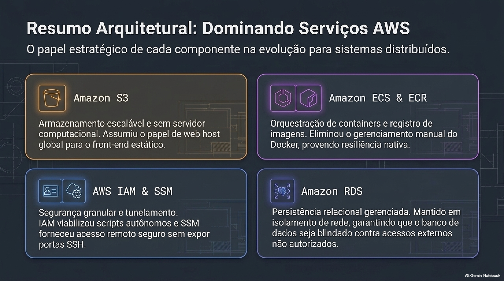

**1. Desacoplar não é sofisticação — é economia.** Tirar o React do contêiner não deixou a aplicação "mais moderna": deixou-a mais barata e mais resiliente. Arquivos estáticos não precisam de CPU, e o S3 não fica lento com pico de acesso porque não há nada ali para sobrecarregar.

**2. O endereço da API é uma decisão de *build*, não de *runtime*.** Foi a lição mais concreta do desafio. O React não "descobre" a API em tempo de execução: o valor é **gravado dentro do JavaScript** no momento do build. Por isso ele precisa entrar por argumento, e por isso trocar o IP exige refazer build **e** sync. É também o argumento mais claro a favor de um Load Balancer: com um endereço estável, o bundle deixa de depender de qual máquina está viva.

**3. Copie do `Dockerfile`, não do tutorial.** A aula ensinava `REACT_APP_API_URL`; esta versão da BIA usa `VITE_API_URL`. O erro seria silencioso — o build passa, o site sobe, e só a tela vazia denuncia. O `Dockerfile` do projeto é a fonte da verdade sobre como aquele projeto se constrói.

**4. Uma mensagem de erro conta mais do que diz.** `database "bia" does not exist` parece um problema de banco. Na verdade é uma **boa notícia**: prova que a rede funciona e a autenticação passou — se não funcionassem, a resposta seria timeout. Aprendi a ler o erro pelo que ele **descarta**, não só pelo que reclama.

**5. Permissão para agir ≠ permissão para delegar.** Descobrir que `AmazonEC2FullAccess` não inclui `iam:PassRole` foi o momento em que o IAM fez sentido. Entregar uma role a uma máquina é um ato de delegação de privilégio, e a AWS o trata como permissão separada de propósito — senão qualquer um poderia escalar privilégios criando uma EC2.

**6. O jeito seguro costuma ser o jeito mais simples.** Diante de um RDS inacessível, a saída tentadora era torná-lo público. A saída certa — SSM até a `bia-dev`, regra de Security Group com origem por **grupo** e não por IP — deu o mesmo trabalho e não abriu o banco para a internet em momento nenhum. Sem porta 22 aberta, sem chave `.pem` circulando.

**7. Automatizar é escrever o erro antes do acerto.** As três validações do `deploy.sh` foram escritas antes de ele funcionar de verdade. Um script que falha em dois segundos, com o código de saída certo e a mensagem de uso, vale mais do que um que funciona no caminho feliz e sincroniza lixo no caminho triste.

**8. Terminar inclui desligar.** Um laboratório na nuvem cobra por hora, e o Auto Scaling **recria** a instância que você encerra. Aprender que a capacidade desejada é quem manda — e que discos EBS continuam custando com a máquina parada — é parte do trabalho, não um detalhe administrativo.

---

## 12. Encerrando os serviços na AWS

Desligar o notebook **não pausa nada**. As EC2 e o RDS continuam de pé, e continuam cobrando por hora — o laboratório não tem botão de "sair". Encerrar faz parte do trabalho, e é o passo que separa um desafio concluído de uma fatura no fim do mês.

A [Fase 9](#fase-9--encerrar-o-laboratório-sem-deixar-conta-aberta) faz isso por linha de comando. Esta seção mostra o mesmo caminho pelo **Console**, tela por tela.

> ⚠️ **Só depois de guardar as evidências.** Parar o cluster derruba a API, e o site do S3 passa a carregar sem dados. Os prints das [Fases 7](#fase-7--confirmar-o-bucket-servindo-o-site) e [8](#fase-8--salvar-um-registro-no-banco-pelo-site) têm de estar feitos antes de começar.

**A ordem importa**, e o motivo de cada posição está na terceira coluna:

```
  1. service-bia     desired tasks = 0      para o ECS nao relancar a task
  2. Auto Scaling    desired/min/max = 0    derruba a EC2 do cluster
  3. bia-dev         stop instance          a maquina de apoio da migrate
  4. RDS "bia"       stop temporarily       o item mais caro da conta
```

Derrubar de baixo para cima não funciona: com o service ainda pedindo uma task, o ECS reage a cada peça que você tira.

### 12.1 Zerar as tasks do `service-bia`

**Por quê:** o service é o *gerente* — o trabalho dele é manter a task de pé. Enquanto o número de tasks desejadas for `1`, ele relança o contêiner que você derrubar, e você fica brigando com a própria infraestrutura. Zerando aqui, o resto desce sem resistência.

```
ECS  >  Clusters  >  cluster-bia  >  Services  >  marcar service-bia  >  Update
```

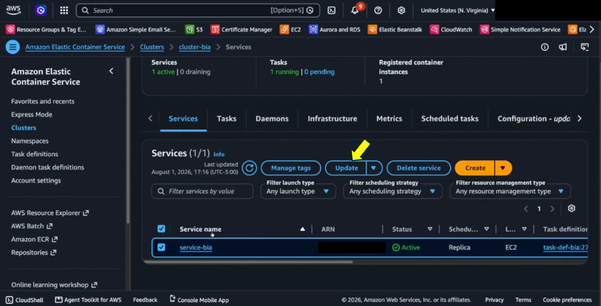

Na tela de update, o campo que interessa é **Desired tasks**. Troque `1` por `0` e confirme em **Update**, no fim da página — todo o resto do formulário fica como está.

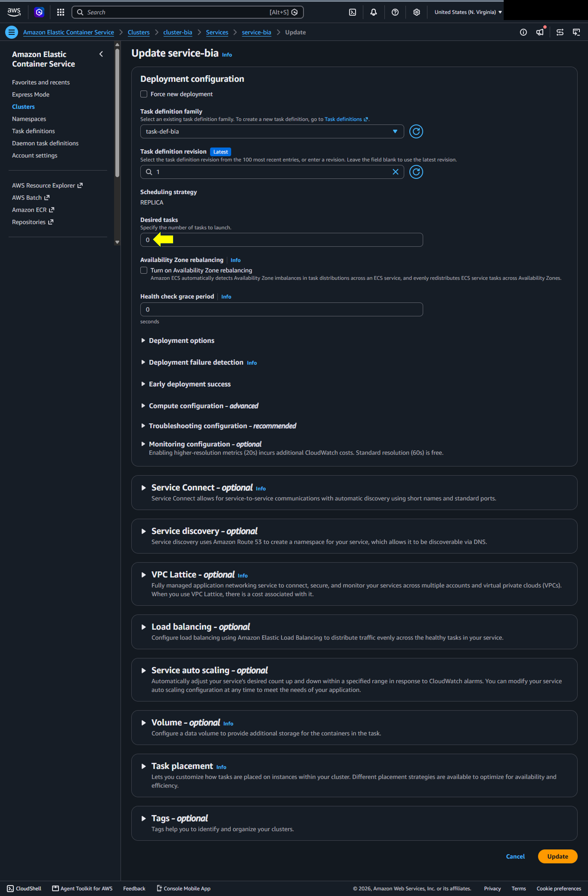

A confirmação vem na aba **Tasks** do cluster: `0 running`.

### 12.2 Zerar o Auto Scaling Group

**Por quê:** a EC2 que roda a API não foi criada por você — ela pertence a um **Auto Scaling Group** com capacidade desejada `1`. Se você mandar `Stop` ou `Terminate` nela direto, o ASG entende que faltou capacidade e **sobe outra no lugar**. A cobrança continua, e a impressão é de que a AWS ignorou o comando. Quem manda aqui é a capacidade desejada.

```
EC2  >  Auto Scaling groups  >  Infra-ECS-Cluster-cluster-bia-...  >  Actions  >  Edit
```

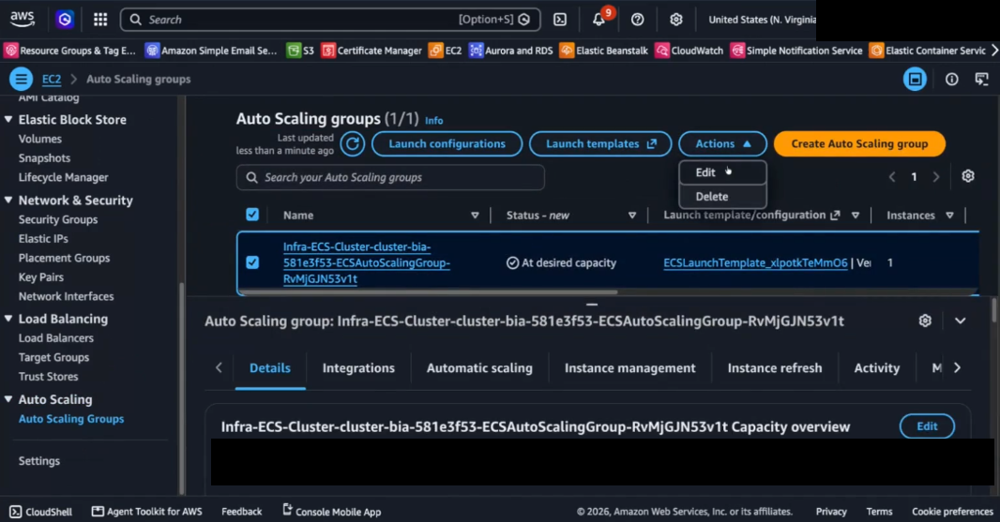

Em **Group size**, os três campos vão a zero — *Desired capacity*, *Min desired capacity* e *Max desired capacity* — e o **Update** fica no fim da página. Zerar só o desejado, deixando o mínimo em `1`, faz o ASG voltar a subir a instância.

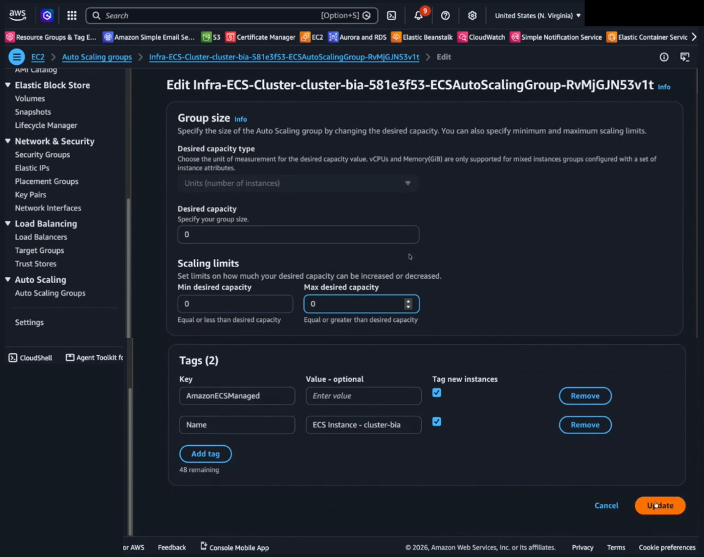

Repare na tag `Name` no rodapé dessa tela: `ECS Instance - cluster-bia`. É ela que dá o nome da máquina na lista do EC2 — a mesma que aparece na captura de [Instâncias EC2](#instâncias-ec2).

### 12.3 Parar a `bia-dev`

**Por quê:** a `bia-dev` é a máquina de apoio; o papel dela terminou quando a migração rodou. Diferente da EC2 do cluster, esta é sua e obedece ao `Stop` — nada a recria. E parar é seguro: o acesso a ela é por **SSM**, que não depende de IP, então ao religar o agente se registra sozinho e a sessão volta a abrir.

```
EC2  >  Instances  >  marcar bia-dev  >  Instance state  >  Stop instance
```

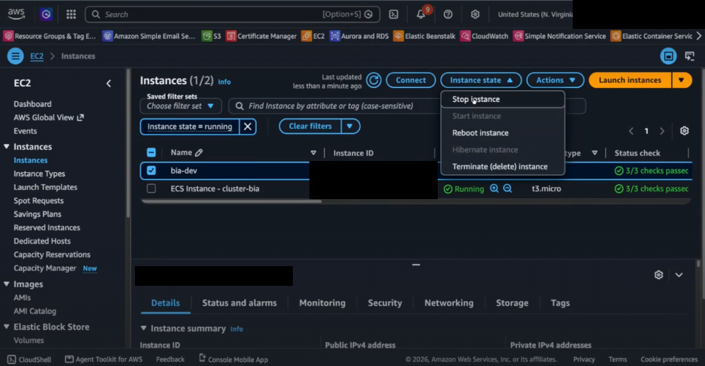

O diálogo de confirmação traz o aviso que mais importa nesta seção: **parar a instância não zera a conta**. Você deixa de pagar pelo uso da máquina, mas continua pagando pelos volumes EBS e por qualquer Elastic IP associado.

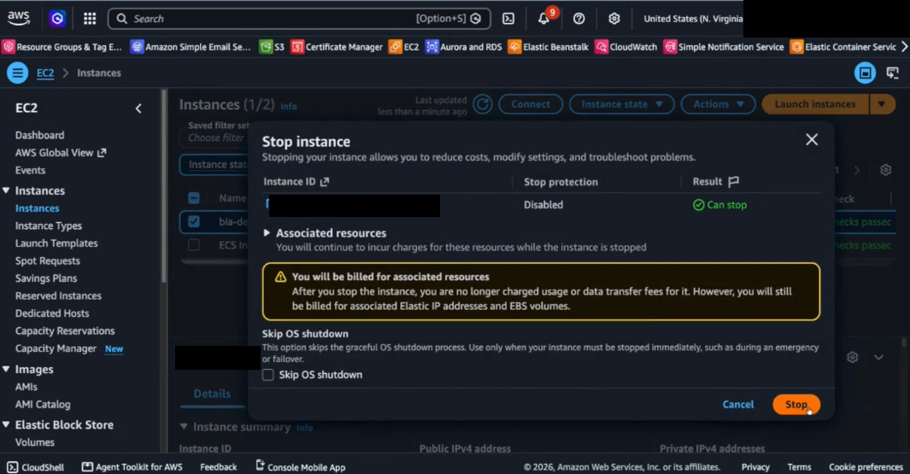

### 12.4 Parar o RDS

**Por quê:** é o item mais caro do laboratório, e o único que sobreviveria por semanas sem ninguém notar. O banco fica preservado — parar não apaga nada.

```
RDS  >  Databases  >  bia  >  Actions  >  Stop temporarily
```

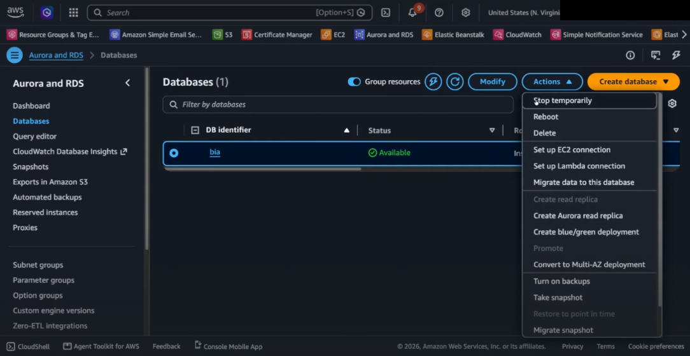

A tela de confirmação diz, sem rodeios, as três coisas que se precisa saber — e é por isso que vale ler em vez de clicar direto:

- a pausa vale **por até 7 dias**, e a instância **religa sozinha** na data que a própria tela informa;
- o que a pausa suspende são as **horas de instância**; o armazenamento provisionado e os backups continuam sendo cobrados;
- se quiser, dá para guardar um **snapshot** antes de parar.

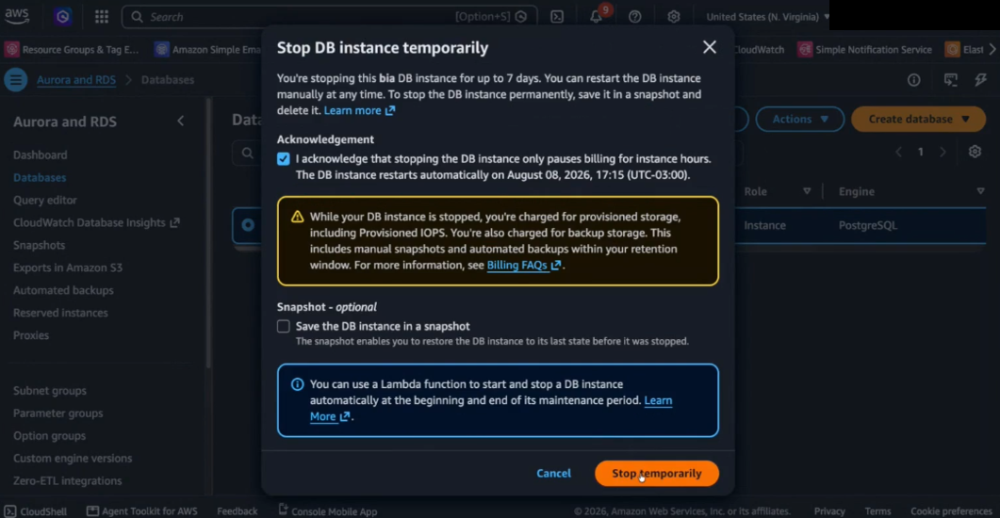

Para uma pausa mais longa que uma semana, o caminho certo não é este: é **apagar a instância com snapshot**, e recriar a partir dele quando precisar.

### O que continua custando com tudo parado

Os discos **EBS** das máquinas e o **armazenamento do RDS** são cobrados enquanto existirem — parar uma EC2 não apaga o disco dela. São alguns dólares por mês, não por hora. O bucket com o site é desprezível: alguns megabytes de arquivos estáticos.

### Ao religar

A ordem se inverte: RDS → Auto Scaling (capacidade de volta a `1`) → `service-bia` (tasks de volta a `1`) → `bia-dev`, se for precisar dela.

> 🔁 **O IP da API muda a cada religada** — e o site publicado continua chamando o endereço antigo, que morreu junto com a instância. O ritual de volta inclui atualizar a `API_URL` e **rodar a [Fase 6](#fase-6--gerar-os-assets-e-sincronizar-com-o-bucket) de novo**. É exatamente o problema que um Load Balancer resolve em produção.

---

## 13. Créditos e referências

### Créditos

Desafio 3 da mentoria **Desafios Fundamentais — Formação AWS**, conduzida por **[Henrylle Maia](https://github.com/henrylle)**.
Projeto BIA v4.3.0 — [github.com/henrylle/bia](https://github.com/henrylle/bia).

### Documentação oficial

- [Hospedar um site estático no Amazon S3](https://docs.aws.amazon.com/pt_br/AmazonS3/latest/userguide/HostingWebsiteOnS3Setup.html)
- [Como funcionam os buckets do Amazon S3](https://docs.aws.amazon.com/pt_br/AmazonS3/latest/userguide/UsingBucket.html)
- [`aws s3 sync` — referência da CLI](https://docs.aws.amazon.com/cli/latest/reference/s3/sync.html)
- [Amazon ECS — conceitos de cluster, service e task definition](https://docs.aws.amazon.com/pt_br/AmazonECS/latest/developerguide/Welcome.html)
- [AWS Systems Manager Session Manager](https://docs.aws.amazon.com/pt_br/systems-manager/latest/userguide/session-manager.html)
- [Security Groups como origem de regras](https://docs.aws.amazon.com/pt_br/vpc/latest/userguide/vpc-security-groups.html)
- [Amazon RDS — conectividade e acessibilidade pública](https://docs.aws.amazon.com/pt_br/AmazonRDS/latest/UserGuide/USER_VPC.WorkingWithRDSInstanceinaVPC.html)
- [Variáveis de ambiente no Vite](https://vitejs.dev/guide/env-and-mode.html)

### Sobre privacidade neste repositório

Os identificadores da conta AWS (número da conta, ARNs, IDs de instância, de security group e de VPC) foram **tarjados nas capturas de tela** e **mascarados no texto** (`xxxxxxxxxxxx`, `i-xxxxxxxxxxxx`, `xx.xx.xx.xx`). Nenhuma senha, chave de acesso ou arquivo `.pem` aparece em qualquer parte deste repositório — e o [`.gitignore`](.gitignore) garante que continue assim.

---

<div align="center">

**Rafael Silva** · [GitHub](https://github.com/RafaelSilva89)

*Desafios Fundamentais · Formação AWS · 2026*

</div>
